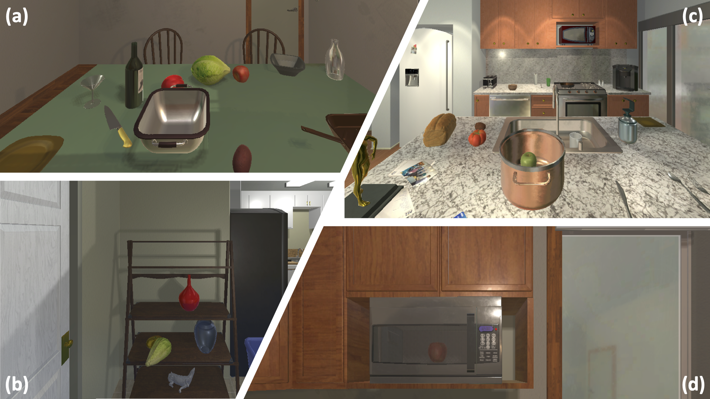

# 📊 Arm Point Nav Dataset (APND)

As a step towards generalizable object manipulation, we present the task of ArmPointNav – moving an object in the scene from a source location to a target location. This involves, navigating towards the object, moving the arm gripper close to the object, picking it up, navigating towards the target location, moving the arm gripper (with the object in place) close to the target location, and finally releasing the object so it lands carefully. In line with the agent navigation task of PointNav, source and target locations of the object are specified via (x, y, z) coordinates in the agent coordinate frame.

To study the task of ArmPointNav, we present the Arm Point Nav Dataset (APND). 


Our data generation process starts by finding all the possible locations in each room per object. Furthermore, we need to separate out the initial object locations for which there exists a valid agent pose that can reach it. This is to ensure the objects in each task of our dataset are reachable by our agent, and there is at least a solution for picking up/dropping off the object in that location. Note that the object in the aforementioned target location can be visible or hidden from the agent’s point of view (e.g., on a table vs. in the closed fridge). Since there is a path between any two agent locations in the room, any pair of possible locations can be considered as a task (which may or may not require navigating the agent in the scene).



The initial location of the object can pose a variety of challenges. In (a) the tomato is occluded by the bowl, therefore the agent needs to remove the bowl to reach the tomato. In (b) the lettuce is on the shelf, which requires the agent to move the arm carefully such that it does not collide with the shelf or the vase. In (c) The goal object is inside another object and in (d) the goal object is inside a receptacle, therefore it requires interacting with another entity (opening microwave’s door) before reaching for the object. The latter case is outside the scope of this code base.

## 📲 Install The Dataset

1. Download the compressed file of the dataset from <a href="https://drive.google.com/file/d/13fOGheELJuoXv_JWRPGcpu2fBY-jKWKB/view?usp=sharing">here</a>.
2. Extract the zip file to `datasets/apnd-dataset` 

## 🗂️ Dataset Hierarchy

Below you can find the description and usecase of each of the files in the dataset.

```
apnd-dataset
└── valid_object_positions ----- Pool of potential object positions
│   └── valid_<OBJECT-NAME>_positions_in_<ROOM-ID>.json
└── deterministic_tasks ----- Deterministic set of tasks, randomly chosen for evaluation
│   └── tasks_<OBJECT-NAME>_positions_in_<ROOM-ID>.json ----- Consists of pairs of initial and goal location of the object
└── starting_pose.json ----- Initial location in each room for which the arm initialization succeeds
└── valid_agent_initial_locations.json ----- Reachable positions for the agent in each room
└── deterministic_valid_agent_initial_locations.json ----- Fixed set of initial locations for the agent which is used during test time (to ensure evaluation consistency).
```


